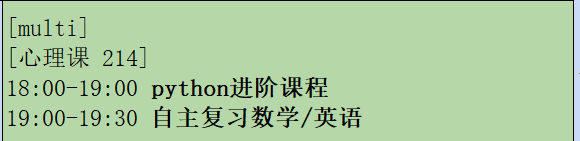
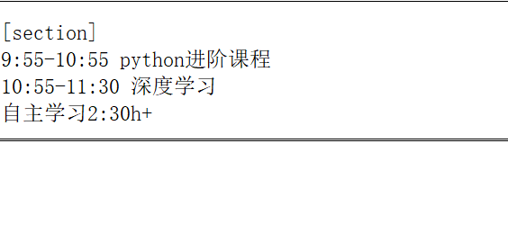

# Schedule Maid

## Guide
1. Install the reqiured library
```shell
pip install -r requirements.txt
```
2. Edit the config.yaml file
```yaml
# company id
CORPID: xxxx
# secret
CORPSECRET: xxxx
# agentid
AGENTID: xxxx
# userid (message will send to them)
TOUSER:
  - XXname
  - XXname2

excelFilePath: schedule.xlsx

XiaoYi:
  - nickname: 主人
  - morningGreeting: 今天又是新的一天。干劲满满哦！来看看今天的计划吧！
  - ana: xiaoyi_ana.txt
```
3. make your schedule.xlsx
The format of xlsx file should refer to `example.xlsx`
In any of the cells, any contents in the brackets will be ignored by this program(except labels, which will be introduced )
There are two types of label should be noticed:
- multi  

In this picture,  
The label `multi` allow you to put multi shedule into a single cell, and the line `[心理课 214]` will be ignored.

- section  

The function of `section` is to merge the current cell with the lower cell. So the lower cell need to be `blank`, otherwise it will be overrided